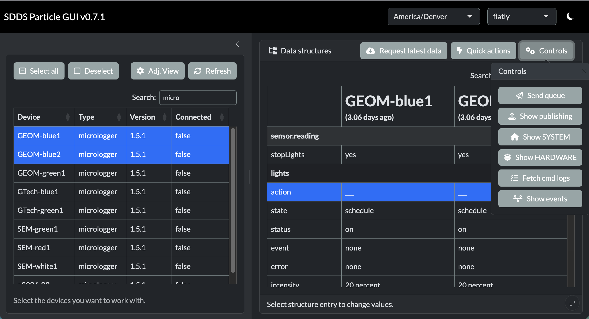
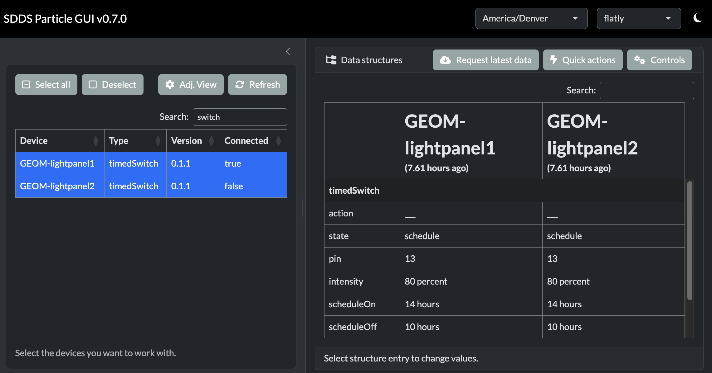
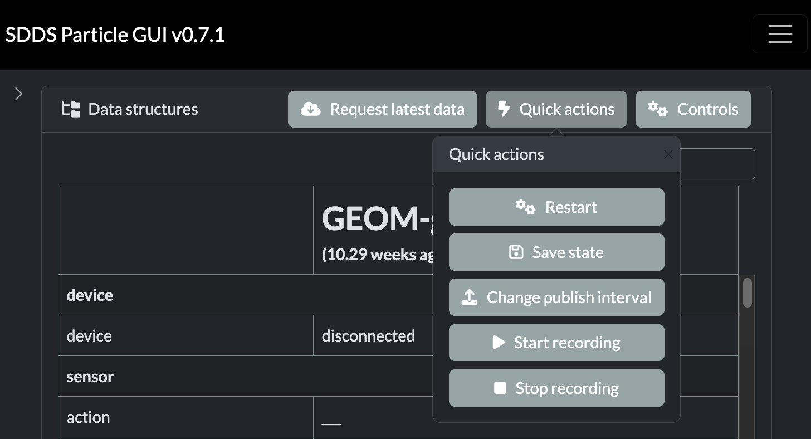
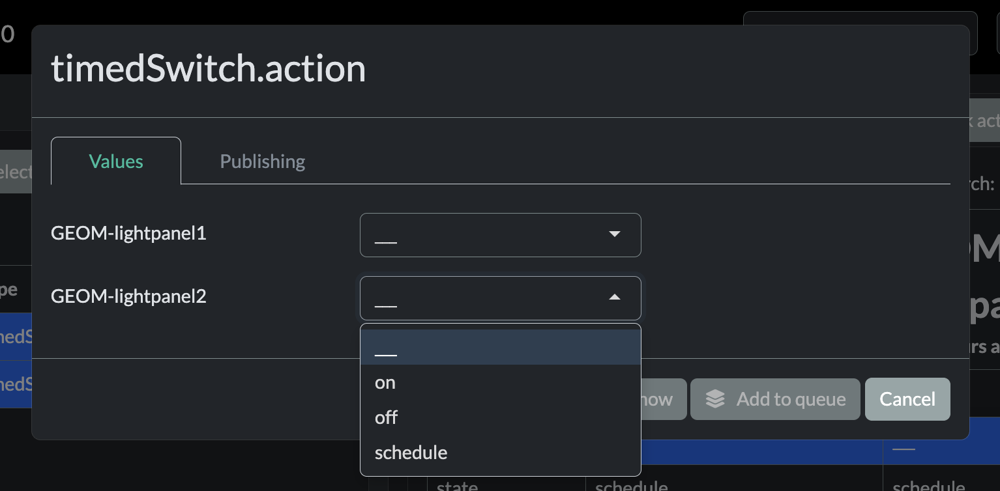
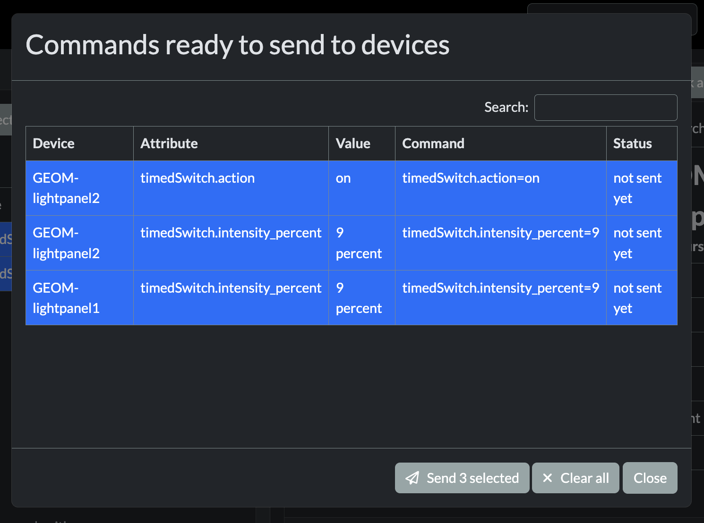
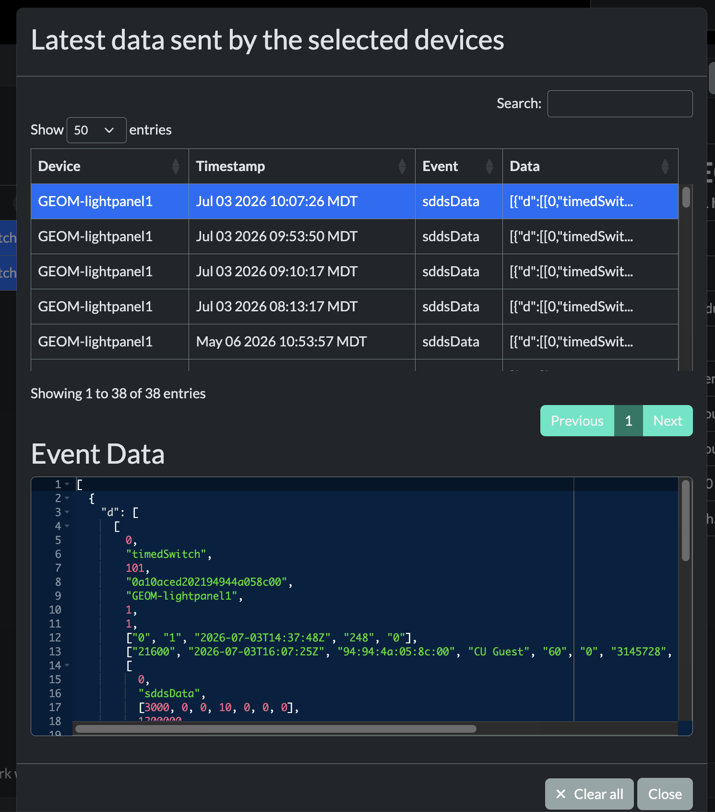

<!-- README.md is generated from README.Rmd. Please edit that file -->

# sddsParticle

<!-- badges: start -->

[](https://lifecycle.r-lib.org/articles/stages.html#experimental)
<!-- badges: end -->

This R package provides a web GUI (and a matching R API) to monitor and
control microcontrollers that run a [self-describing data structure
(SDDS)](https://github.com/mLamneck/SDDS) firmware via
[particleSpike](https://github.com/KopfLab/SDDS_particleSpike) on
[Particle](https://www.particle.io/) devices.

Because the firmware describes its own variable tree, the app builds its
entire interface on the fly: it discovers each device’s structure,
renders it as an editable tree, and lets you change values, queue and
send commands, inspect the command history, and watch live data events —
all from the browser, without writing any device-specific UI.

<figure>

<figcaption aria-hidden="true">Screenshot of the sddsParticle GUI
example app</figcaption>
</figure>

## Features

- **Automatic device discovery** — lists the SDDS Particle devices
  registered to your account, with connection status, firmware version
  and last-seen time.
- **Self-describing UI** — reads each device’s structure tree and
  renders it as an editable table; the appropriate input widget
  (integer, double, enum, duration, etc.) is chosen automatically from
  the value type. A variable’s units are read straight from a trailing
  `_units` suffix on its name — e.g. `voltage_V` or `interval_ms`, with
  additional underscores rendered as `/` for compound units (`rate_mg_L`
  → `mg/L`).
- **Publishing control** — show/hide and edit the publishing interval of
  every variable directly in the tree.
- **Command log & live events** — fetch the recent command history of a
  device and stream its live data events into a table with
  pretty-printed JSON.
- **Multi-device operation** — select several devices at once and apply
  the same change to all of them.
- **Reusable Shiny module** — the GUI is a set of composable UI/server
  pieces, so you can embed the device controller into your own Shiny
  app.

## Installation

You can install the development version of sddsParticle from
[GitHub](https://github.com/KopfLab/sddsParticle) with:

``` r
# install.packages("pak")
pak::pak("KopfLab/sddsParticle")
```

## Getting started

The package talks to the Particle Cloud on your behalf, so it needs a
Particle [access
token](https://docs.particle.io/reference/cloud-apis/access-tokens/).
Store it once — it is kept securely in your operating system’s keyring
and never written to disk by the package:

``` r
library(sddsParticle)

# run once to store your Particle access token in your OS keychain
particle_store_token()
```

Then launch the example GUI:

``` r
sdds_run_gui()
```

You can restrict the app to a subset of devices:

``` r
sdds_run_gui(accessible_core_ids = c("0a10aced20f19d944a058c00"))
```

## Using the app

**1. Select devices.** Pick one or more devices from the sidebar. The
table shows the name, type, version and connection status; use the “Adj.
View” button to show additional columns. Once one or multiple devices
are selected, the devices’ self-describing structure tree is shown in
table format with the most recently retrieved values from the devices
(the column headers with the device names shows how long ago the data
was retrieved).

Click the ***Request latest data*** button to fetch the latest values
from the selected devices for all variables in the tree. The
***Controls*** button opens a menu that lets you toggle the publishing
information for each varaible; show the devices’ `SYSTEM` and `HARDWARE`
sections (which are usually not necessary to interact with and thus
hidden by default); fetch the devices’ command logs; or open the live
events viewer.



`SYSTEM` section: every SDDS Particle device shares a common `SYSTEM`
section (device identity, vitals, and recording/publishing settings)
that the ***Controls-\>Show SYSTEM*** toggle reveals — see the [`SYSTEM`
structure
reference](https://github.com/KopfLab/SDDS_particleSpike#the-system-structure)
for what each field means.

`HARDWARE` section: some SDDS Particle devices have a `HARDWARE` section
that provides access to the low level hardware components of the device.
Whether this section exists and what it contains depends on each device.
The ***Controls -\> Show HARDWARE*** toggle reveals this section.

**2. Use quick actions.** The ***Quick actions*** menu (top-right of the
data structures card) collects one-click shortcuts to the most common
operations — they open the edit dialog focused on a specific variable
from the data structure tree so the user does not have to search for
them in the tree first. **The set of available quick actions is defined
by each app**: the example app (`sdds_run_gui()`) provides the ones
listed below, while apps built on the sddsParticle module can define
their own (see [Building your own app](#building-your-own-app)).

- **Restart** — restart the device (`SYSTEM.action = restart`).
- **Save state** — write the current settings to the device’s permanent
  memory (`SYSTEM.action = saveState`) so they survive a power cycle.
- **Change publish interval** — edit the device-wide global publish
  interval (`SYSTEM.publishing.globalInterval_ms`).
- **Start recording** / **Stop recording** — turn data
  recording/publishing to the cloud on or off
  (`SYSTEM.publishing.record`).



**3. Explore and edit the data structure.** The quick actions provide
direct access to some of the most common variable in the data structure.
Use the search field in the upper right corner of the structure table to
search for specific variables beyond the quick actions or scroll through
the table to explore what is available. Click any variable/row to pop up
a dialog to change its value (unless it’s read-only) for one or
multilple of the selected devices and send the corresponding change
command to the device(s) over the web. The pop-up dialogs will show
different types of edit interfaces depending on the variable type
ranging from simple numeric value input boxes (with or without units) to
specific action dropdowns.




Two things to keep in mind when you send a value change command to the
device(s):

- The structure table will keep showing the values from the last fetch —
  click ***Request latest data*** to pull the updated values back from
  the device(s) and confirm the change took effect.
- A change to a *saveable* variable only lives in the device’s working
  memory until you run the **Save state** quick action
  (`SYSTEM.action = saveState`, see quick actions); until then it is not
  written to permanent memory and is lost on the next restart or power
  cycle.

**4. Edit the publishing behaviour of individual variables.** Beyond the
device-wide global record toggle and publishing interval (see quick
actions), **every variable can be published on its own schedule**. When
you open a structure entry to edit it, the dialog has a second
**Publishing** tab that sets how (and how often) that particular
variable is sent to the cloud. Turn on the ***Controls -\> Show
publishing*** toggle to also see each variable’s current setting next to
its value in the tree.

The available indiviudal variable publishing options are:

- **average over global interval (if recording)** — if the device is
  recording (`SYSTEM.publishing.record`): within the global publish
  interval (see quick actions / `SYSTEM.publishing.globalInterval_ms`),
  each new value of the variable is averaged and a single average value
  is sent once per device’s global publish interval. Averaged values
  also carry the number of measurements and the standard deviation over
  the averaging window, so noisy signals can be logged compactly without
  losing information about their spread. If the device is not recording,
  this variable does not publish to the cloud.
- **average over individual interval (if recording)** — same as above,
  but averaged over a custom interval you specify (x number of
  ms/sec/min/hour/day).
- **send each change (if recording)** — if the device is recording:
  publish a value every time it changes. This setting is intended for
  variables that change infrequently (e.g. settings) rather than
  e.g. sensor readings which should be averaged over a specific time
  interval instead (see above). Be very careful to use this setting for
  frequently changing variables as it will quickly max out the available
  number of cloud publish events (typically ~100,000/month across all
  devices).
- **send each change (always)** — publish every change regardless of the
  recording switch. This is useful for status flags you always want
  reported, no matter whether the device is formally recording or not.
  Same as above, be very careful to use this setting for frequently
  changing variables.
- **never send** — never publish this variable.

Note that the `HARDWARE` node in the structure (if it exists) usally
does NOT have publishing options for its variables as HARDWARE sdds
variables are not intended to be published.


**5. Check the command queue.** Open ***Controls -\> Send queue*** to
see commands that have been sent, review pending commands and send (or
resend) selected commands to the devices.



**6. Check live events.** ***Controls - \> Show events*** opens a table
of the data events streamed from the selected devices, with the full
payload shown as formatted JSON.



## Building your own app

`sdds_run_gui()` is just a thin example around a reusable Shiny module.
The UI is composed of small building blocks and the logic lives in a
single server function, so you can lay the controller out however you
like:

``` r
library(shiny)
library(bslib)
library(sddsParticle)

# quick actions appear in the data structures card and edit an SDDS path on click
quick_actions <- list(
  sdds_ui_quick_action("restart", "Restart", icon = icon("gears"),
               path = "SYSTEM.action", value = "restart"),
  sdds_ui_quick_action("save", "Save state", icon = icon("floppy-disk"),
               path = "SYSTEM.action", value = "saveState")
)

ui <- page_sidebar(
  header = sdds_header(),                      # required <head> content
  sidebar = sidebar(fillable = TRUE, sdds_ui_devices_card("sdds")),
  sdds_ui_structures_card("sdds", quick_actions = quick_actions)
)

server <- function(input, output, session) {
  sdds_server("sdds", token = keyring::key_get("particle"),
              quick_actions = quick_actions)
}

# the onStart handler connects to the live event stream
shinyApp(ui, server, onStart = sdds_onstart(token = keyring::key_get("particle")))
```

## Custom value editors

The structure editor picks an input widget automatically from each
value’s type (integer, double, enum, duration, etc.). However, a host
app can additional register its own value types — for example an editor
for a resistance stored in Ohm that switches between Ohm/kOhm/MOhm — and
pass it to `sdds_server()`:

``` r
# convert between the stored value (in Ohm) and the displayed value + units
res_to_input <- function(value, units) {
  if (value > 1e6) list(v = value / 1e6, u = "MOhm")
  else if (value > 1e3) list(v = value / 1e3, u = "kOhm")
  else list(v = value, u = "Ohm")
}
res_to_value <- function(input, units) {
  input$v * switch(input$u, MOhm = 1e6, kOhm = 1e3, 1)
}

# build the editor: a numeric value shown next to a units selector
resistance_editor <- function(id) {
  input_module_selectable_units(
    id,
    value_to_input = res_to_input,
    input_to_value = res_to_value,
    value_to_text  = function(value, units) with(res_to_input(value, units), paste(v, u)),
    units_options  = c("Ohm", "kOhm", "MOhm")
  )
}

# register it — `condition` decides which structure values use this editor
sdds_server(
  "sdds", token = keyring::key_get("particle"),
  additional_value_types = list(
    resistance = sdds_value_type(
      condition = base_units == "Ohm",
      module    = resistance_editor
    )
  )
)
```

## Programmatic API

You don’t need the GUI to talk to devices. The `particle_*()` functions
wrap the relevant Particle Cloud endpoints, and the `sdds_parse_*()`
helpers turn the raw JSON into tidy tibbles:

``` r
# discover devices, request and parse the structure of several cores
devices <- particle_get_device_info()
systems <- particle_get_and_parse_sdds_systems(devices$coreid)

# send commands to a device (returns per-command success)
particle_send_sdds_commands("<coreid>", cmds = c("SYSTEM.action=restart"))

# connect to the live event stream and collect events
particle_stream_connect()
particle_stream_monitor()      # print incoming events in the console
events <- particle_stream_get_events()
particle_stream_disconnect()
```

## Related projects

- [SDDS](https://github.com/mLamneck/SDDS) — the self-describing data
  structure library for microcontrollers.
- [particleSpike](https://github.com/KopfLab/SDDS_particleSpike) — the
  SDDS integration for Particle devices that this package talks to.
