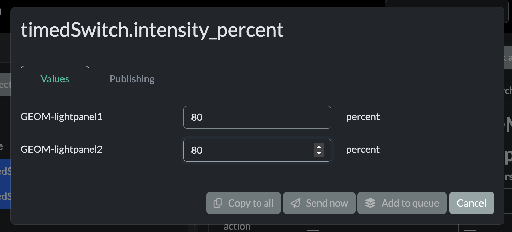
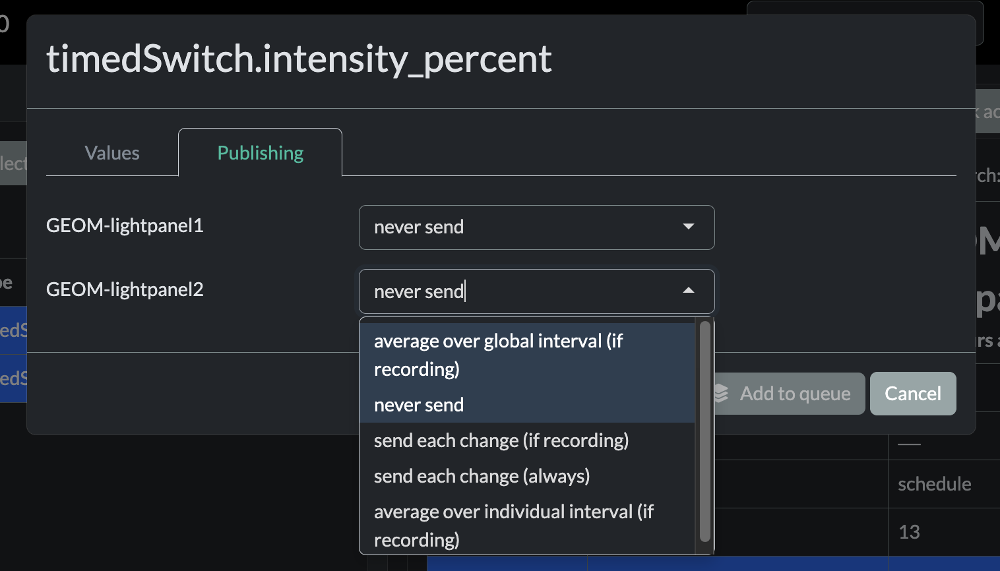

<!-- README.md is generated from README.Rmd. Please edit that file -->

# sddsParticle

<!-- badges: start -->

[](https://lifecycle.r-lib.org/articles/stages.html#experimental)
<!-- badges: end -->

sddsParticle provides a web GUI (and a matching R API) to monitor and
control microcontrollers that run a [self-describing data structure
(SDDS)](https://github.com/mLamneck/SDDS) firmware via
[particleSpike](https://github.com/KopfLab/SDDS_particleSpike) on
[Particle](https://www.particle.io/) devices.

Because the firmware describes its own variable tree, the app builds its
entire interface on the fly: it discovers each device’s structure,
renders it as an editable tree, and lets you change values, queue and
send commands, inspect the command history, and watch live data events —
all from the browser, without writing any device-specific UI.

<figure>

<figcaption aria-hidden="true">Overview of the sddsParticle
GUI</figcaption>
</figure>

## Features

- **Automatic device discovery** — lists the SDDS Particle devices
  registered to your account, with connection status, firmware version
  and last-seen time.
- **Self-describing UI** — reads each device’s structure tree and
  renders it as an editable table; the appropriate input widget
  (integer, double, enum, duration, etc.) is chosen automatically from
  the value type. A variable’s units are read straight from a trailing
  `_units` suffix on its name — e.g. `voltage_V` or `interval_ms`, with
  additional underscores rendered as `/` for compound units (`rate_mg_L`
  → `mg/L`).
- **Publishing control** — show/hide and edit the publishing interval of
  every variable directly in the tree.
- **Command log & live events** — fetch the recent command history of a
  device and stream its live data events into a table with
  pretty-printed JSON.
- **Multi-device operation** — select several devices at once and apply
  the same change to all of them.
- **Reusable Shiny module** — the GUI is a set of composable UI/server
  pieces, so you can embed the device controller into your own Shiny
  app.

## Installation

You can install the development version of sddsParticle from
[GitHub](https://github.com/KopfLab/sddsParticle) with:

``` r
# install.packages("pak")
pak::pak("KopfLab/sddsParticle")
```

## Getting started

The package talks to the Particle Cloud on your behalf, so it needs a
Particle [access
token](https://docs.particle.io/reference/cloud-apis/access-tokens/).
Store it once — it is kept securely in your operating system’s keyring
and never written to disk by the package:

``` r
library(sddsParticle)

# run once to store your Particle access token in your OS keychain
particle_store_token()
```

Then launch the example GUI:

``` r
sdds_run_gui()
```

You can restrict the app to a subset of devices:

``` r
sdds_run_gui(accessible_core_ids = c("0a10aced20f19d944a058c00"))
```

## Using the app

**1. Select devices.** Pick one or more devices from the sidebar. The
table shows the name, type, version and connection status; use the “Adj.
View” button to show additional columns.

<figure>

<figcaption aria-hidden="true">Device selection</figcaption>
</figure>

**2. Explore and edit the data structure.** The selected devices’
structure tree is shown as an editable table. Click a row to change its
value; the “Controls” menu lets you toggle the publishing, system and
hardware sections, request the latest values, fetch command logs, or
open the live events viewer.





**3. Review and send the command queue.** Edited values can be sent
right away or added to a queue first. Open “Send queue” to see commands
that have been sent, review pending commands and send the selected ones
to the devices.

<figure>

<figcaption aria-hidden="true">Command queue</figcaption>
</figure>

**4. Check live events.** “Show events” opens a table of the data events
streamed from the selected devices, with the full payload shown as
formatted JSON.

<figure>

<figcaption aria-hidden="true">Live events</figcaption>
</figure>

## Building your own app

`sdds_run_gui()` is just a thin example around a reusable Shiny module.
The UI is composed of small building blocks and the logic lives in a
single server function, so you can lay the controller out however you
like:

``` r
library(shiny)
library(bslib)
library(sddsParticle)

# quick actions appear in the data structures card and edit an SDDS path on click
quick_actions <- list(
  sdds_ui_quick_action("restart", "Restart", icon = icon("gears"),
               path = "SYSTEM.action", value = "restart"),
  sdds_ui_quick_action("save", "Save state", icon = icon("floppy-disk"),
               path = "SYSTEM.action", value = "saveState")
)

ui <- page_sidebar(
  header = sdds_header(),                      # required <head> content
  sidebar = sidebar(fillable = TRUE, sdds_ui_devices_card("sdds")),
  sdds_ui_structures_card("sdds", quick_actions = quick_actions)
)

server <- function(input, output, session) {
  sdds_server("sdds", token = keyring::key_get("particle"),
              quick_actions = quick_actions)
}

# the onStart handler connects to the live event stream
shinyApp(ui, server, onStart = sdds_onstart(token = keyring::key_get("particle")))
```

## Custom value editors

The structure editor picks an input widget automatically from each
value’s type (integer, double, enum, duration, etc.). However, a host
app can additional register its own value types — for example an editor
for a resistance stored in Ohm that switches between Ohm/kOhm/MOhm — and
pass it to `sdds_server()`:

``` r
# convert between the stored value (in Ohm) and the displayed value + units
res_to_input <- function(value, units) {
  if (value > 1e6) list(v = value / 1e6, u = "MOhm")
  else if (value > 1e3) list(v = value / 1e3, u = "kOhm")
  else list(v = value, u = "Ohm")
}
res_to_value <- function(input, units) {
  input$v * switch(input$u, MOhm = 1e6, kOhm = 1e3, 1)
}

# build the editor: a numeric value shown next to a units selector
resistance_editor <- function(id) {
  input_module_selectable_units(
    id,
    value_to_input = res_to_input,
    input_to_value = res_to_value,
    value_to_text  = function(value, units) with(res_to_input(value, units), paste(v, u)),
    units_options  = c("Ohm", "kOhm", "MOhm")
  )
}

# register it — `condition` decides which structure values use this editor
sdds_server(
  "sdds", token = keyring::key_get("particle"),
  additional_value_types = list(
    resistance = sdds_value_type(
      condition = base_units == "Ohm",
      module    = resistance_editor
    )
  )
)
```

## Programmatic API

You don’t need the GUI to talk to devices. The `particle_*()` functions
wrap the relevant Particle Cloud endpoints, and the `sdds_parse_*()`
helpers turn the raw JSON into tidy tibbles:

``` r
# discover devices, request and parse the structure of several cores
devices <- particle_get_device_info()
systems <- particle_get_and_parse_sdds_systems(devices$coreid)

# send commands to a device (returns per-command success)
particle_send_sdds_commands("<coreid>", cmds = c("SYSTEM.action=restart"))

# connect to the live event stream and collect events
particle_stream_connect()
particle_stream_monitor()      # print incoming events in the console
events <- particle_stream_get_events()
particle_stream_disconnect()
```

## Related projects

- [SDDS](https://github.com/mLamneck/SDDS) — the self-describing data
  structure library for microcontrollers.
- [particleSpike](https://github.com/KopfLab/SDDS_particleSpike) — the
  SDDS integration for Particle devices that this package talks to.
